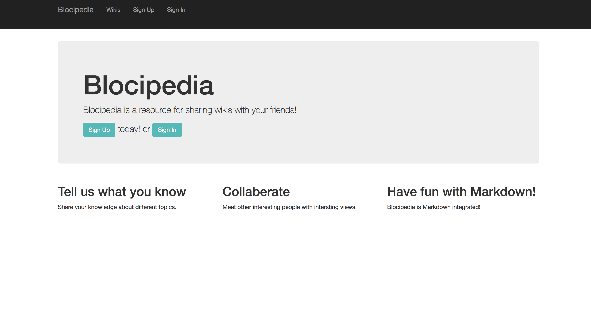
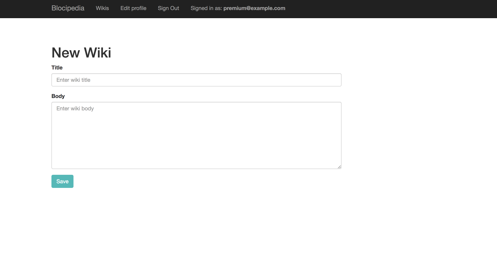
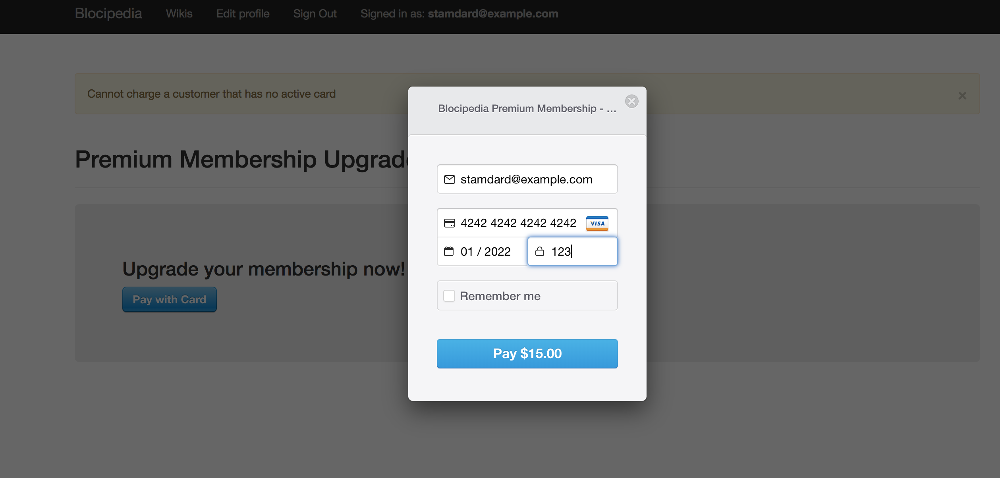
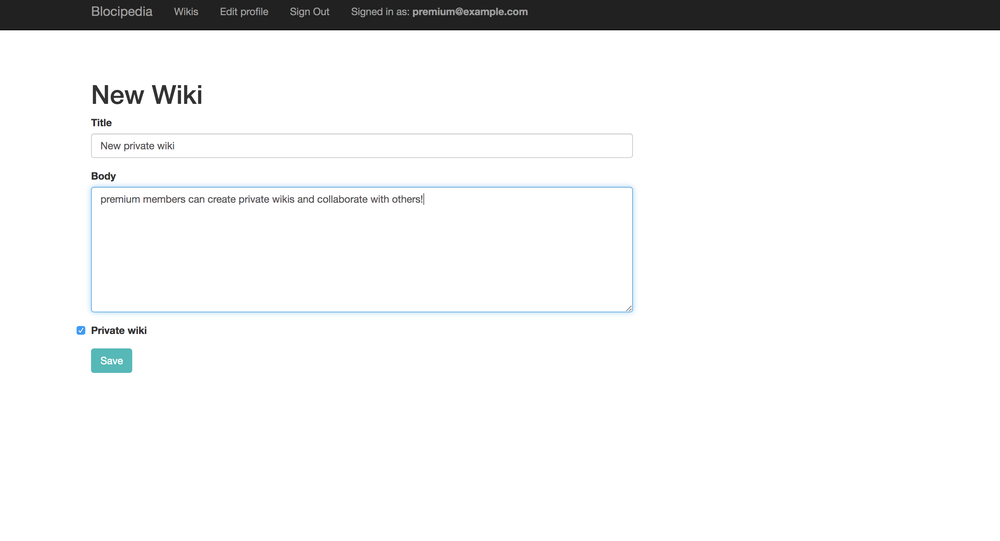
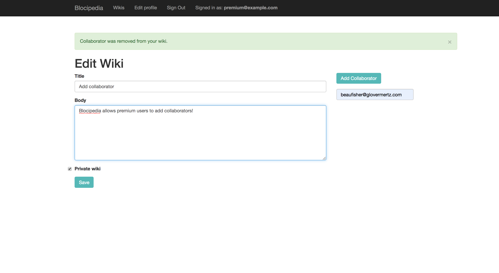

# Blocipedia

Blocipedia is a CRUD Rails application that allows users to create private and public Markdown-based wikis.

## Dependencies
* ruby 2.5.1
* rails 5.2.1
* For ActiveModel validations use [thoughtbot / shoulda ](https://github.com/thoughtbot/shoulda)
* [pundit](https://github.com/varvet/pundit) - simplifies authorization
* [stripe](https://stripe.com/docs/development) - 3rd party e-commerce vendor
* [redcarpet](https://github.com/vmg/redcarpet) - Markdown parser

## Configuration
* Devise used for user authentication
* SENDGRID used for Environment Variables

## Test-Driven-Development
* rspec-rails, '~> 3.0'

## Database
* Use sqlite for testing and development
* Use PostgreSQL for production

## Deployment
* Heroku

## Blocipedia Features

* Add new wikis

* Upgrade to Premium Membership with Stripe

* Now you can make your wikis private and add collaborators

